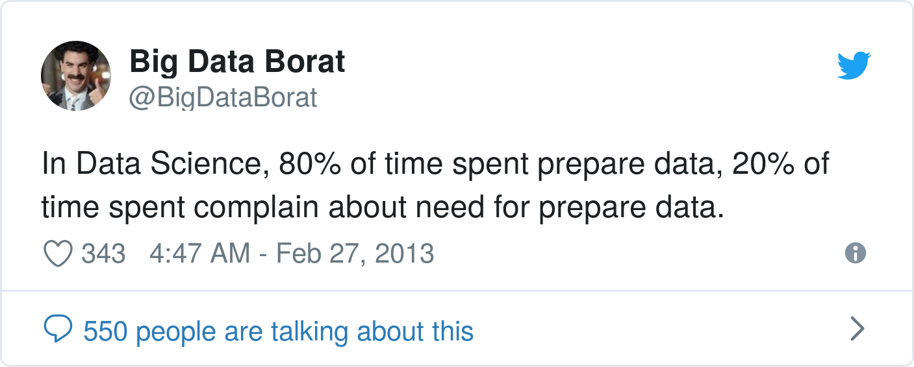

Hiring an engineer and post-doc to simplify data science on dirty data
=======================================================================

:date: 2021-10-29
:tags: machine learning, data science, dirty data, hiring

.. note::

   Join us to work on reinventing data-science practices and tools to
   produce robust analysis with less data curation.

It is well known that data cleaning and preparation are a heavy burden to
the data scientist.

Dirty data research
--------------------

In the `dirty data project <https://project.inria.fr/dirtydata/>`_, we
have been conducting machine-learning research to see how better
statistical models could readily ingest non-curated data, and reduce the
need of data preparation for data science. We now have a growing
understanding of the problems, theoretical and practical, which lie
across statistical and database topics.

Machine learning leads to different tradeoffs than traditional
inferential statistics (because it can rely on more powerful model). For
instance, we now have a good understanding of the case of missing values:
in `Le Morvan et al <https://arxiv.org/abs/2106.00311>`_, we showed that
with traditional methods, ignorable missingness [#]_ and "good"
imputation are important, but it turns out for prediction, flexible
predictors are what matters and they can work on any missingness
mechanism.

.. [#] "Missing at Random", where missingness is independent of the
       hidden values

Similarly, we have made good progress on tolerating normalization errors
and typos. We find that rather to attempt to deduplicate the entries or
fix the typos, it is best to represent similarities and ambiguities to
a flexible learning algorithm. The simplest and most reliable methods are
implemented in the `dirty-cat <http://dirty-cat.github.io/>`_ library, to
facilitate the life of data-scientists

Reinventing data science
-------------------------

With this understanding (and even more exciting on-going research), we
want to revisit data science. Machine-learning can provide flexible
models for many usages of data science. Our goal is to use it to help
assembling and analyzing datasets while minimizing human efforts. For
this, we need tools that can answer typical data-science questions using
machine learning and starting from the raw data, often spread in multiple
files or multiple tables of a databases. Building these tools requires
data-science research, a new vision of data-science APIs, and careful
software crafting.

Join us in this adventure
---------------------------

We have an `awesome team <https://project.inria.fr/dirtydata/team/>`_,
with a great mix of people of different seniority, different expertise
(statistics, machine learning, databases, software engineering), sharing
offices with the `scikit-learn at Inria
<https://scikit-learn.fondation-inria.fr/home/>`_. But we have too many
exciting ideas, so we are growing this team.

A data-science engineer: new software with new ideas
.......................................................

We are looking for someone with a background in data science or numerical
Python programming to join us, to help with designing a new data-science
library, evolving from `dirty-cat <http://dirty-cat.github.io/>`_, and
to help with data-science experimentation for the research.

We like people who care about data, designing good tools, and have vision
about data science. We are happy to consider different level of
experience. Apply on `the job offer
<https://jobs.inria.fr/public/classic/fr/offres/2021-04182>`_.

A post-doc researcher: science joining data engineering to deep learning
..........................................................................

We will soon be announcing a post-doc position to join the team for
research in this scope. We are interested in questions around learning on
relational or tabular data, or learning data integration. We have plenty
of ideas to explore around embeddings in databases, learning to
aggregate, learning on sets, graph neural networks for databases, or
distributional matching for entity and schema alignment.
We expect to be borrowing tools (conceptual and practical) from deep
learning, but to blending them with techniques from data integration,
knowledge graphs, and databases.

The job posting will be out soon, but I am running out of the office
right now for vacations (work-life balance also matters to us).

.. topic:: Diversity is important

   `Our team <https://project.inria.fr/dirtydata/team/>`_ is not as
   diverse as I would like it to be (though probably doing better than
   typical computer-science team). We love diverse candidates. Do not
   hesitate.

