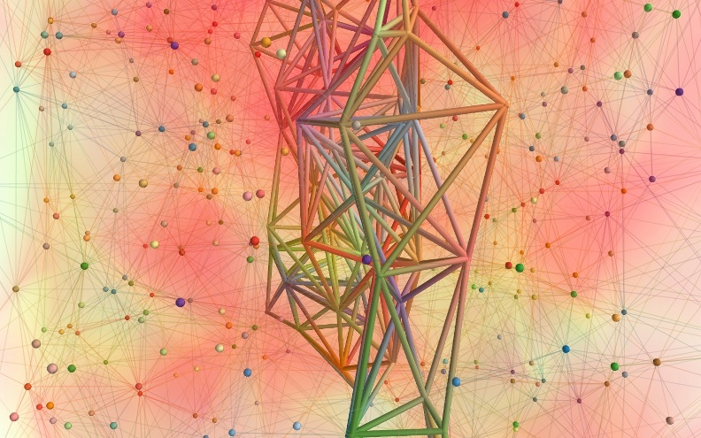

Mayavi image of the ... month
#############################

:date: 2009-04-27 22:42
:tags: python, scipy, mayavi, scientific computing, art

Tonight I sat down and played a bit with VTK's Delaunay tessalation
filter. I wanted to inspect the local structure of a graph created by
Delaunay tessalation of random points. To see better the structure, I
selected a slab of the resulting unstructured grid. I think the image is
not only instructive to explain what a Delaunay tessalation is, it also
looks pretty cool. Here is the image and the Mayavi `script`_ that
creates it.

.. _script: attachments/delaunay_py

