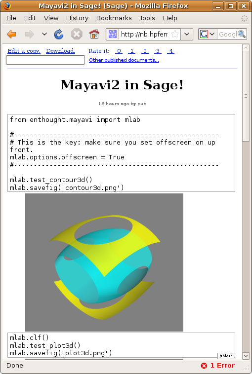

Mayavi on the web
#################
:date: 2009-03-07 13:06
:tags: mayavi, scientific computing

`Ondrej Certik`_ has installed a `sage`_ notebook on a server opened to
the net, with `Mayavi`_ installed on it. The result is that you have a
command line interface on the web, in which you can enter Mayavi
commands, and see the result. You have to be very careful to switch
Mayavi in offscreen mode as soon as you load it. To see the result of a
plot, just save it in a file. The sage notebook will display the image.

I have always had in mind the use of Mayavi as a backend for a
scientific web application, for instance for a neuromaging database, but
what is really stuning with this implementation, is the way you interact
with it: full-blown Python comand line.

.. _Ondrej Certik: http://ondrejcertik.blogspot.com/
.. _sage: http://www.sagemath.org/
.. _Mayavi: http://code.enthought.com/projects/mayavi/

