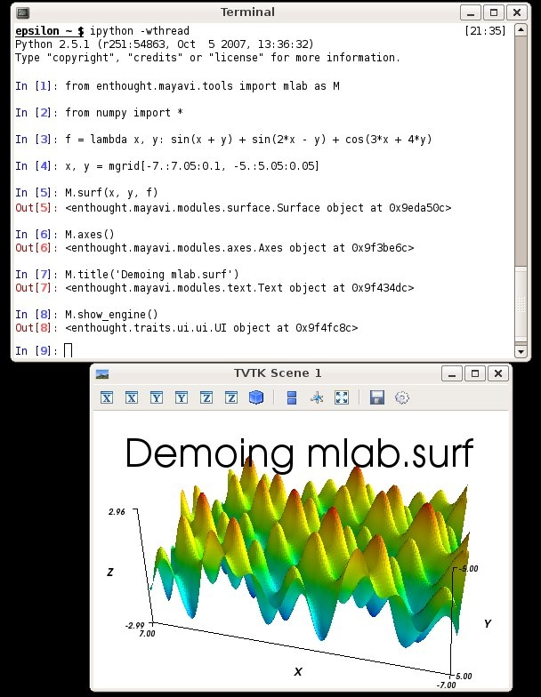
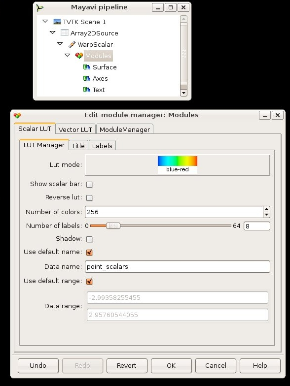

Mayavi2: using from ipython
###########################

:date: 2008-01-04 03:38
:tags: python, mayavi, scientific computing

Recently Prabhu and I have been ironing the library aspect of Mayavi2
(library as opposed to application). One of the usecases we are
interested in, is interative use, via for instance ipython, *a la*
pylab.

Most people think of Mayavi as a big and powerful application, maybe a
bit clunky to script and to get to interact with other bits of code.
With the recent additions you can use mayavi just as you would use
matplotlib, to complete matplotlib's 3D plotting.

3D plotting from ipython
========================

As Mayavi relies on wxPython (technical details, yes I know you don't
care), to use it with ipython, you have to start ipython with *iptyhon
-wthread*. Using ipython from svn you can start ipython with both the
*-pylab* and the *-wthread* options to use both pylab and mayavi for 2D
and 3D plotting (beware of namespace mangling, **don't** use *from
module import \**).

The matlab/pylab-like interface to Mayavi is found in
*enthought.mayavi.tools.mlab*\ (this will most probably change to
*enthought.mayavi.mlab*, or to something else shorter), import this
module to have familiar functions. Documentation is a bit missing for
now, (you can grab some kind of a embryo at
https://svn.enthought.com/enthought/attachment/wiki/MayaVi/mlab.pdf?format=raw
), so I'll just show an example:

.. code-block:: python

    from enthought.mayavi.toosl import mlab as M
    from numpy import *

    f = lambda x, y: sin(x + y) + sin(2*x - y ) + cos(3*x + 4*y)
    x, y = mgrid[-7:7.05:0.1, -5:5.05:0.05]
    M.surf(x, y, f)
    M.axes()
    M.title('Demoing mlab.surf')

Apart from the *surf* command, the different commands used have
equivalents in pylab. *surf* is inspired from matlab: let us continue
pylab's work here. OK, the keyword arguments are not exactly the same,
and not all pylab features are available through the mayavi/mlab
interface. But the good news is that the objects created are VTK
objects, even though it is a bit hidden by this simplified interface.
This means that there is the power of VTK, and that you can always
modify the resulting objects to fine tune properties that you cannot
(yet) tweak with keyword arguments.

Modifying the plot from the GUI
===============================

OK, as you see, we can control Mayavi without all the fuss of the user
interface. We get a really simple window that does not get in our way.
But is this still Mayavi? This clunky UI was convenient to interact with
the visualization. I can pop the pipeline up using *M.show\_engine()*.
Once I have the pipeline I can easily double click on any of the items I
want to modify, and I get the usual Mayavi dialogs that are so
convenient when trying to tweak a scene, for instance to modify the
colormap:

This is still work in progress, but *mlab* is completely useable for
real work (I use it whenever I want to make a figure in 3D). Beware that
the API is not cast into stone (that's a good moment to make remarks)
and that it might change. Documentation is also lacking. Don't worry it
will come pretty soon, but I also have a thesis to defend :->.

