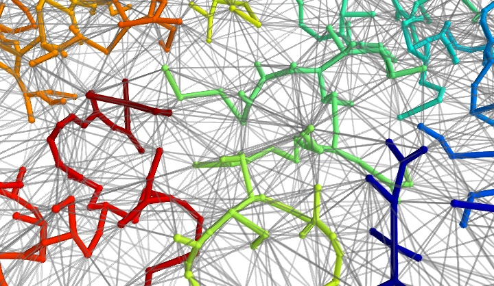

Minimum spanning tree
#####################

:date: 2009-05-10 23:52
:tags: python, mayavi, scientific computing, algorithms

Gary Ruben came up with the excellent idea of visualizing the minimum
spanning tree of a Delaunay tesselation in addition to Delaunay
tessalation itself. After he sent me his code, I spent some times
playing with it, because I found out that, with the right choice of
visualization parameter, it gave me a nice understanding of what a
minimum spanning tree was: a tree structure of minimal total length
connecting all the vertices of the graphs, and embedded in the graph. On
the visualization, the Delaunay graph is displayed in grey, and the
minimum spanning tree in thick and colors.

The minimum spanning tree is calculated using Prim's algorithms, on the
fullly-connected distance-weighted graph of all points. One can clearly
see that is it embedded in the Delaunay graph. In fact I have tested
that calculating a minimum spanning tree on the Delaunay graph, or on
the complete graph, gave the same result.

The code to create this picture can be found `here`_.

.. _here: attachments/mst_py

