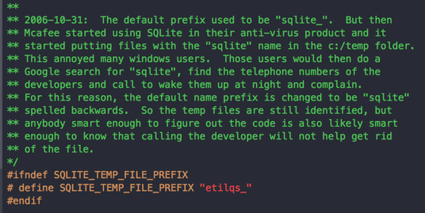

=====================================================================
Software for reproducible science: let's not have a misunderstanding
=====================================================================

:date: 2015-05-18
:tags: science, software, reproducible research, scientific software

.. |nbsp| unicode:: U+00A0

.. note::

   **tl;dr:** |nbsp| *Reproducibilty is a noble cause and scientific
   software a promising vessel. But excess of reproducibility can be at
   odds with the housekeeping required for good software engineering.
   Code that "just works" should not be taken for granted.*
   
   *This post advocates for a progressive consolidation effort of
   scientific code, rather than putting too high a bar on code release.*

`Titus Brown <http://ivory.idyll.org/blog/>`_ recently shared `an
interesting war story
<http://ivory.idyll.org/blog/2015-how-should-we-think-about-research-software.html>`_
in which a reviewer refuses to review a paper until he can run the code
on his own files. Titus's comment boils down to:

 .. epigraph::

    `"Please destroy this software after publication"
    <http://ivory.idyll.org/blog/2015-how-should-we-think-about-research-software.html>`_.

.. note::
    :class: align-right

    Reproducible science: Does the emperor have clothes?

In other words, code for a publication is often not reusable. This
point of view is very interesting from someone like Titus, who is a
`vocal proponent
<http://ivory.idyll.org/blog/a-conversation-on-reproducibility.html>`_ of
reproducible science. His words triggered some surprises, which led Titus
to wonder if `some of the reproducible science crowd folks live in a
bubble <http://ivory.idyll.org/blog/2015-we-live-in-a-bubble.html>`_. I
was happy to see `the discussion
<https://twitter.com/ctitusbrown/status/589171853031186434>`_ unroll, as
I think that there is a strong risk of creating a bubble around
reproducible science. Such a bubble will backfire.

.. Let me share my point of view on software for reproducible science.

Replication is a must for science and society
==============================================

Science advances by accumulating knowledge built upon
observations. It's easy to forget that these observations, and the
corresponding paradigmatic conclusions, are not always as simple to
establish as the fact that hot air rises: **replicating many times the
scientific process transforms an evidence into a truth**.

One striking example of scientific replication is `the on-going effort in
psychology
<http://www.nature.com/news/first-results-from-psychology-s-largest-reproducibility-test-1.17433>`_
to replay the evidence behind well-accepted findings central to
current line of thoughts in psychological sciences. It implies setting up
the experiments accordingly to the seminal publications, acquiring the
data, and processing it to come up to the same conclusions. Surprisingly,
not everything that was taken for granted holds.

.. note::
    :class: align-right

    Findings later discredited backed economic policy

Another example, with massive consequences on Joe Average's everyday, is
the failed replication of Reinhart and Rogoff's `"Growth in a Time of
Debt" <http://en.wikipedia.org/wiki/Growth_in_a_Time_of_Debt>`_
publication. The original paper, published in 2010 in the American
Economic Review, claimed empirical findings linking important public debt
to failure of GDP growth. In a context of economical crisis, it was used
by policy makers as a justification for restricted public spending.
However, while pursuing a mere homework assignment to replicate these
findings, `a student uncovered methodological flaws with the paper
<http://www.bbc.com/news/magazine-22223190>`_. Understanding the
`limitations
<http://www.nextnewdeal.net/rortybomb/researchers-finally-replicated-reinhart-rogoff-and-there-are-serious-problems>`_
of the original study took a while, and **discredited the academic
backing to the economical doctrine of austerity**. Critically, the
analysis of the publication was possible only because Reinhart and Rogoff
**released their spreadsheet, with data and analysis details**.

Sharing code can make science reproducible
===============================================

A great example of sharing code to make a publication reproducible is the
recent paper on `orthogonalization of regressors in fMRI models
<http://journals.plos.org/plosone/article?id=10.1371/journal.pone.0126255>`_,
by Mumford, Poline and Poldrack. The paper is a didactic refutation
of non-justified data processing practices. The authors made their
point much stronger by giving `an IPython notebook
<http://nbviewer.ipython.org/github/jmumford/orthogonalizaton_ipynb/blob/master/orthogonalization.ipynb>`_
to reproduce their figures. The recipe works perfectly here, because the
ideas underlying the publication are simple and can be illustrated on
synthetic data with relatively inexpensive computation. A short IPython
notebook is all it takes to convince the reader.

.. note::
    :class: align-right

    Sharing complex code... chances are it won't run on new data.

At the other end of the spectrum, a complex analysis pipeline will not be
as easy to share. For instance, a feat of strength such as Miyawaki *et
al*'s `visual image
reconstruction from brain activity
<http://www.cell.com/neuron/abstract/S0896-6273%2808%2900958-6>`_
requires complex statistical signal processing to extract weak
signatures. Miyawaki *et al* shared the data. They might share the code, but
it would be a large chunk of code, probably fragile to changes in the
environment (Matlab version, OS...). Chances are that it wouldn't run on
new data. This is the scenario that prompted Titus's words:

 .. epigraph::

    `"Please destroy this software after publication"
    <http://ivory.idyll.org/blog/2015-how-should-we-think-about-research-software.html>`_.

I have good news: you can reproduce Miyawaki's work with `an example
<http://nilearn.github.io/auto_examples/decoding/plot_miyawaki_reconstruction.html>`_
in `nilearn <http://nilearn.github.io>`_, a library for
machine learning on brain images. The example itself is concise,
readable and it reliably produces figures close to that of the paper. 

.. note::
    :class: align-right

    Maintained libraries make feats of strength routinely
    reproducible.

This easy replication is only possible because **the corresponding code
leverages a set of libraries that encapsulate the main steps of the
analysis**, mainly `scikit-learn <http://scikit-learn.org/stable/>`_ and
`nilearn <http://nilearn.github.io>`_ here. These libraries are 
`tested <https://travis-ci.org/nilearn/nilearn>`_, `maintained
<https://github.com/nilearn/nilearn/issues?q=is%3Aissue+is%3Aclosed>`_
and `released
<http://gael-varoquaux.info/programming/scikit-learn-015-release-highlights.html>`_.
They enable us to go from a feat of strength to routine replication.

.. * An example of non-reproducible research (my ICML paper)

.. Can research be up to the software engineering challenge?

Reproducibility is not sustainable for everything
===================================================

..  
  Things are not always that easy
  
  It's not you, it's me
  
  Nobody said it was easy
  
  Living up to the promise?

.. epigraph::

    Thinking is easy, acting is difficult |nbsp| |nbsp| |nbsp|
    ---  |nbsp| |nbsp| |nbsp|  *Goethe*

.. note::
    :class: align-right

    Keeping a physics apparatus running for replication years later?

I started my scientific career doing physics, and fairly `"heavy" physics
<http://gael-varoquaux.info/science/general-relativity-quantum-physics-freely-falling-planes-and-bayesian-statistics.html>`_:
vacuum systems, lasers, free-falling airplanes. In such settings, the
cost of maintaining an experiment is apparent to the layman. No-one is
expected to keep an apparatus running for replication years later. The
pinnacle of reproducible research is when the work becomes doable in a
students lab. Such progress is often supported by improved
technology, driven by wider applications of the findings.

However, not every experiment will give rise to a students lab.
Replicating the others will not be easy. Even if the instruments are
still around the lab, they will require setting up, adjusting and wiring.
And chances are that connectors or cables will be missing.

Software is no different. Storing and sharing it is cheaper. But
technology evolves very fast. Every setup is different. Code for a
scientific paper has seldom been built for easy maintenance: lack of
tests, profusion of exotic dependencies, inexistent documentation.
Robustness, portability, isolation, would be desirable, but it is
difficult and costly. 

Software developers know that understanding the constraints to design a
good program requires writing a prototype. **Code for a scientific paper
is very much a prototype**: it's a first version of an idea, that proves
its feasibility. Common sense in software engineering says that
`prototypes are designed to be thrown away
<http://blog.codinghorror.com/the-prototype-pitfall/>`_. Prototype code
is fragile. It's untested, probably buggy for certain usage. Releasing
prototypes amounts to distributing semi-functioning code. This is the
case for most code accompanying a publication, and it is to be expected
given the very nature of research: exploration and prototyping [#]_.

.. Quality scientific software require making choices

.. Doing less, better

.. Quality scientific software, only for a happy few

No success without quality, ... 
================================

.. note::
    :class: align-right

    Highly-reliable is more useful than state-of-the-art.

My experience with scientific code has taught me that success require
quality. Having a good implementation of simple, well-known, methods
seems to matter more than doing something fancy. This is what the
success of scikit-learn has taught us: we are really providing classic
"old" machine learning methods, but with a good API, good docs,
computational performance, and stable numerics controlled by stringent
tests. There exists plenty of more sophisticated machine-learning
methods, including some that I have developed specifically for my data.
Yet, I find myself advising my co-workers to use the methods in
scikit-learn, because I know that the implementation is reliable and that
they will be able to use them [#]_.

This quality is indeed central to doing science with code. What good is a
data analysis pipeline if it crashes when I fiddle with the data? How can
I draw conclusions from simulations if I cannot change their parameters?
As soon as I need trust in code supporting a scientific
finding, I find myself tinkering with its input, and often breaking it.
Good scientific code is code that can be reused, that can lead to
large-scale experiments validating its underlying assumptions.

   Sqlite is so much used that its developers have been woken up at
   night by users.

You might say that I am putting the bar too high; that slightly buggy
code is more useful than no code. But I frown at the idea of releasing
code for which I am unable to do proper quality assurance. I may have
done too much of that in the past. And because I am a prolific coder, many
people are using code that has been through my hands. My mailbox looks
like a battlefield, and when I go the coffee machine I find myself
answering questions.

.. Pour vivre heureux, vivons cachés.
   http://en.wikipedia.org/wiki/Jean-Pierre_Claris_de_Florian

... and making difficult choices
==================================

.. diminishing returns

.. note::
    :class: align-right

    Craftsmanship is about trade-offs 

Achieving quality requires making choices. Not only because time
is limited, but also because the difficulty to maintain and improve a
codebase increases much quicker than the numbers of features [#]_. This
phenomena is actually frightening to watch: adding a feature in
scikit-learn these days is much much harder than what it used to be in
the early days. Interactions between features is a killer: when you
modify something, something else unrelated breaks. For a given
functionality, **nothing makes the code more incomprehensible than
cyclomatic complexity**: the multiplicity of branching, if/then clauses,
for loops. This complexity naturally appears when supporting different
input types, or minor variants of a same method.

The consequence is that ensuring quality for many variants of a method is
prohibitory. This limit is a real problem for reproducible
science, as science builds upon comparing and opposing models. However,
ignoring it simply leads to code that fails doing what it claims to do.
What this is telling us, is that if we are really trying to do long-term
reproducibility, we **need to identify successful and important research
and focus our efforts on it**.

If you agree with my earlier point that the code of a publication is
a prototype, this iterative process seems natural. Various ideas
can be thought of as competing prototypes. Some will not lead to
publication at all, while others will end up having a high impact.
Knowing before-hand is impossible. Focusing too early on achieving high
quality is counter productive. What matters is **progressively
consolidating the code**.

.. XXX rephrase the above to avoid 'what matters'?

.. I am sorry to say that my publications are not based on code with 90% test coverage.

.. say that my methods in machine learning will probably never make it to
   scikit-learn

Reproducible science, a rich trade-off space
=============================================

.. note::
    :class: align-right

    Verbatim replication or reuse?

Does Reinhart and Rogoff's *"Growth in a Time of Debt"* paper face the
same challenges as the manuscript under review by Titus? One is
describing mechanisms while the other is introducing a method. The code
of the former is probably much simpler than that of the latter. Different
publications come with different goals and code that is more or less easy
to share. For verbatim replication of the analysis of a paper, a simple
IPython notebook without tests or API is enough. To go beyond requires
applying the analysis to different problems or data: reuse. Reuse is
very difficult and cannot be a requirement for all publications.

.. As someone who spends a lot of time on method development, I think a lot
   in terms of code reuse. On the contrary, 

Conventional wisdom in academia is that science builds upon ideas and
concepts rather than methods and code. Galileo is known for his
contribution to our understanding of the cosmos. Yet, methods
development underpins science. Galileo is also the inventor of the
telescope, which was a huge technical achievement. He needed to develop
it to back his cosmological theories. Today, Galileo's measurements are
easy to reproduce because telescopes are readily-available as consumer
products.

|

.. epigraph::

    Standing on the shoulders of giants |nbsp| |nbsp| ---  |nbsp| |nbsp|
    *Isaac Newton, on software libraries*

|

.. topic:: **Related posts**:

  * `Publishing scientific software matters <../science/publishing_scientific_software_matters.html>`_

  * `Personal views on scientific computing <views_on_scientific_computing.html>`_

.. With great powers come great responsibility

.. Some publications, including computational ones, strive to contribute an idea.

.. The way I understand Titus's
   phrase *"Please destroy this software after publication"* is that some
   methods publication

.. Is the output of a paper the idea, or the code? It depends? (example of
   the ICML)

.. Different code complexity, different trade-off (loops back to the point
   above with Poldrack)

.. XXX: need to point to the donoho paper and cite it

.. Recommendations (in a separate blog post?):
  
  * What the difficulties are (evolving APIs, plus configuration problems)
    (skip this point?)
  
  * don't publish method work on non open data (very restrictive, I have
    been criticized for working on 'old', 'uninteresting' data).

.. [#] To make my point very clear, releasing buggy untested code is not
   a good thing. However, it is not possible to ask for all research
   papers to come with industial-quality code. I am trying here to push
   for a collective, reasoned, undertaking of consolidation.

.. [#] Theory tells us that there is there is no universal machine
   learning algorithm. Given a specific machine-learning application, it
   is always possible to devise a custom strategy that out-performs a
   generic one. However, `do we need hundreds of classifiers to solve
   real world classification problems?
   <http://jmlr.org/papers/volume15/delgado14a/delgado14a.pdf>`_
   Empirical results `[Delgado 2014]
   <http://jmlr.org/papers/volume15/delgado14a/delgado14a.pdf>`_ show
   that most of the benefits can be achieved with a small number of
   strategies. Is it desirable and sustainable to distribute and keep
   alive the code of every machine learning paper?

.. [#] Empirical studies on the workload for programmers to achieve a
   given task showed that 25 percent increase in problem complexity results in
   a 100 percent increase in programming complexity: `An Experiment on
   Unit increase in Problem Complexity, Woodfield 1979
   <http://ieeexplore.ieee.org/Xplore/login.jsp?url=http%3A%2F%2Fieeexplore.ieee.org%2Fiel5%2F32%2F35909%2F01702600.pdf%3Farnumber%3D1702600&authDecision=-203>`_.

.. class:: small

    I need to thank my colleague `Chris Filo Gorgolewski
    <http://multiplecomparisons.blogspot.fr>`_ and my sister `Nelle
    Varoquaux <http://cbio.ensmp.fr/~nvaroquaux/>`_ for their
    feedback on this note.

