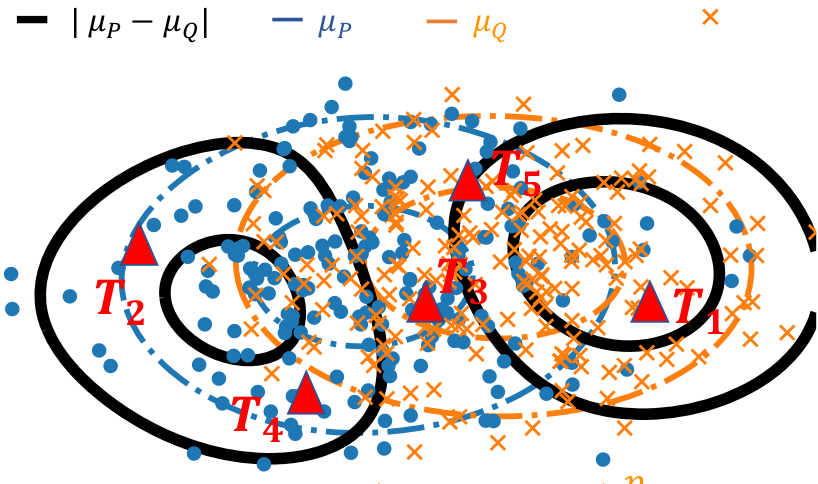

======================================================
2019: my scientific year in review
======================================================

:date: 2020-1-5
:tags: science, research, machine learning, neuroimaging, statistics
:status: draft

My current research interests span wide: from brain sciences to core data
science. My overall quest is to build **methodology drawing insights from
data** for questions that have often been addressed qualitatively. If I can
highlight a few publications from 2019 [1]_, the common thread would be
computational statistics, from dirty data to brain images. Let me try to
give the gist of these progresses, in simple terms.

.. class:: side-hanging

  .. [1] It's already 2019, I'm always late.

.. contents:: Highlights
   :depth: 1

|

Comparing distributions
=========================

.. class:: align-right

   *Fundamental computational-statistics work*

What if you are given two set of observations and need to conclude on
whether they are drawn from the same distribution? We are interested in
this question for the `DirtyData <https://project.inria.fr/dirtydata/>`_
research project, to facilitate analysis of data without manual curation.
Comparing distributions is indeed important to detect drifts in the data,
to match information across datasets, or to compensate for dataset
biases.

Formally, we are given two cloud of points (circle and crosses in the
figure below) and we want to develop a statistical test of whether the
distributions differ. There is an abundant literature on this topic, that I
cover in `a more detailed post on this subject
<http://gael-varoquaux.info/science/comparing-distributions-kernels-estimate-good-representations-l1-distances-give-good-tests.html>`_.
Specifically, when the observations have a natural similarity, for
instance when they live in a vector space, kernel methods are interesting
because they enable to estimate a representant of the underlying
distribution that interpolates between observations, as with `a kernel
density estimator
<https://en.wikipedia.org/wiki/Kernel_density_estimation>`_.

   Two cloud of points, the corresponding distribution representants μ_P
   and μ_Q (blue and orange), the difference between these
   (black), and locations to measure this difference (red triangles).

|

In
`Scetbon & Varoquaux, NeurIPS <http://papers.nips.cc/paper/9398-comparing-distributions-ell_1-geometry-improves-kernel-two-sample-testing>`_,
we investigate how to measure best the difference between these
representants. We show that the best choice is to take the absolute value
of the difference (the l1 norm), while the default choice had so far been
the Euclidean (l2) norm. In a nutshell, the reason is that the difference
most like is dense when the distributions differ: zero almost nowhere.

We were able to show that the `sophisticated framework
<https://slideslive.com/38921490/interpretable-comparison-of-distributions-and-models>`_
for efficient and powerful tests in the
Euclidean case carries over to the l1 case. In particular, our paper
gives efficient testing procedures using a small number of locations to
avoid costly computation (the red triangles in the figure above), that
can either be sampled at random or optimized.

My hunch is that the result is quite general: the l1 geometry is better
than the l2 one on representants of distributions. There might be more
fundamental mathematical properties behind this. The drawback is that the
l1 norm is non smooth which can be challenging in optimization settings.

|

Predictive pipelines on brain functional connectomes
====================================================

.. class:: align-right

   *Brain-imaging methods*

Brain functional connectivity is increasingly used to extract biomarkers
of behavior and mental health. The long-term stakes are to ground
assessment of psychological traits on quantitative brain
data, rather than qualitative behavioral observations. But, to build
biomarkers, there are many details that go in estimating functional
connectivity from fMRI, something that I have studied for more than 10
years. In `Dadi et al
<https://www.sciencedirect.com/science/article/abs/pii/S1053811919301594>`_
we ran thorough empirical benchmarks to find which methodological choices
for the various steps of the pipeline give best prediction across
multiple cohorts. Specifically, we studied 1) defining regions of
interest for signal extraction, 2) building a functional-connectivity
matrix across these regions, 3) prediction across subjects with
supervised learning on these features.

.. figure:: ../science/attachments/2019_highlights/dadi_2019_highlights.png
   :align: center
   :width: 600
   :target: https://www.sciencedirect.com/science/article/abs/pii/S1053811919301594

   Summarizing our benchmark results.

.. sidebar:: Recommendations

   * functional regions (eg from dictionary learning)
   * tangent-space for covariances
   * l2-logistic regression

Results show the importance of defining regions from functional data,
ideally with a linear-decomposition method that produces soft
parcellations such as ICA or dictionary learning. To represent
connectivity between regions, the best choice is tangent-space
parametrization, a method to build a vector-space from covariance
matrices (more below). Finally, for supervised learning, a simple
l2-penalized logistic regression is the best option. With the huge popularity
of deep learning, it may surprise that linear models are the best
performer, but this is well explained by the amount of data at hand: a
cohort is typically less than 1000 individuals, which is way below the
data sizes needed to see the benefits of non-linear models.

A recent preprint, `Pervaiz et al
<https://www.biorxiv.org/content/10.1101/741595v2.abstract>`_ from
Oxford, overall 
confirms our findings, even though they investigated slightly
different methodological choices. In particular, they find tangent space
clearly useful.

|

In my eyes, such benchmarking studies are important not only to improve
prediction, but also to reduce analytic variability that opens the door
to inflation of reported effects. Indeed, given 1000 individuals, the
measure of prediction accuracy of a pipeline is quite imprecise
(`Varoquaux 2018
<https://www.sciencedirect.com/science/article/abs/pii/S1053811917305311>`_).
As a consequence, trying out a bunch a analytic choices and
publishing the one that works best can lead to grossly optimistic
prediction accuracies. **If we want trust in biomarkers, we need to
reduce the variability in the methods used to build them**.

|

Population shrinkage of covariance
====================================

.. class:: align-right

   Statistics for brain signals

Estimating covariances is central for functional brain connectivity and
in many other applications. In `Rahim et al
<https://www.sciencedirect.com/science/article/abs/pii/S1361841518301014>`_
we considered the case of a population of random processes with
related covariances, as for instance when estimating functional
connectivity from a group of individuals. For this, we combined two
mathematical ideas: that of using natural operations on covariance
matrices, and that of priors for mean-square estimation:

* **Tangent space** Covariance matrices are positive-definite matrices,
  for which standard arithmetics are not well suited [2]_: subtracting
  two covariance matrices can lead to a matrix that cannot be
  the covariance of a signal. However, a group of covariance matrices can
  be transformed into points in a vector space for which standard
  distances and arithmetics respect the structure of
  covariances (for instance Euclidean distance between these points
  approximate KL divergence between covariances). This is what we call
  the *tangent space*.

.. class:: side-hanging

   .. [2] Technically, covariance matrices live on a Riemannian manifold:
          a curve surface inside *R^{n x n}* that has some metric
          properties.

* **James-Stein shrinkage** To estimate the mean of *n* observations, it
  is actually best not to compute the average of these, but rather to
  push a bit this average toward a prior guess. The better the
  guess, the more this "push" helps. The more the number of observations,
  the more gentle this push should be. This strategy is known as
  `James-Stein shrinkage
  <https://en.wikipedia.org/wiki/James%E2%80%93Stein_estimator>`_ and it
  is in my opinion one of the most beautiful results in statistics.
  It can be seen as a Bayesian posterior, but it comes with guarantees
  that do not require the model to be true and that control estimation
  error, rather than a posterior probability.

James-Stein shrinkage is easily written for quadratic errors on vectors,
but cannot be easily applied to covariances, as they do not live in a vector
space and we would like to control a KL divergence rather than
a quadratic error. Our work combined both ideas to give an excellent
estimator of a family of related covariances that is also very
computationally efficient. We call it PoSCE: Population Shrinkage
Covariance Estimation.

.. figure:: ../science/attachments/2019_highlights/posce.png
   :align: center
   :width: 600
   :target: https://www.sciencedirect.com/science/article/abs/pii/S1361841518301014

   Schema of the estimation strategy: projecting the covariances matrices
   into a tangent space, shrinkage to a group mean, but taking in account
   the anisotropy of the dispersion of the group, and projecting back to
   covariances.

It is easy to see how accounting for group information in the estimation
of individual covariances can help stabilizing them. However, will it be
beneficial if we are interested in the differences between these
covariances, for instance to ground biomarkers, as studied above? Our
results show that it does indeed help building better biomarkers, for
instance to predict brain age. The larger the group of covariances used,
the larger the benefits.

.. figure:: ../science/attachments/2019_highlights/posce_age_learning_curve.png
   :align: center
   :width: 500
   :target: https://www.sciencedirect.com/science/article/abs/pii/S1361841518301014

   Error in predicting brain aging decreases when more individuals are used
   to build the biomarker.

|

Deep learning on non-translation-invariant images
===================================================

.. class:: align-right

   Computer vision

Brain images, in particular images of brain activity, are very different
from the natural images on which most computer-vision research focuses.
An central difference is that detecting activity in different part of the
brain completely changes the meaning of this detection, while detecting a
cat in the left or the right of a picture on facebook makes no
difference. This is important because many progresses of computer vision,
such as convolutional neural networks, are built on the fact that natural
images are statistically translational invariant. On the opposite, brain
images are realigned to a template, before being analyzed.

Convolutional architectures have been crucial to the successes of deep
learning on natural images because they impose a lot of structure on the
weights of neural networks and thus help fight estimation noise. For
predicting from brain images, the regularizations strategies that have
been successful foster spatially continuous structures. Unfortunately,
they have lead to costly non-smooth optimizations that cannot easily be
used with the optimization framework of deep learning, stochastic
gradient descent.

In `Aydore et al, ICML
<http://proceedings.mlr.press/v97/aydore19a.html>`_, we have introduced a
spatial regularization that is compatible with the deep learning toolbox.
During the stochastic optimization, we impose random spatial structure
via feature groups estimated from the data. These stabilize the input
layers of deep architecture. They also lead to iterating on smaller
representations, which greatly speeds up the algorithm.

.. figure:: ../science/attachments/2019_highlights/stochastic_grouping_mlp.png
   :align: center
   :width: 600
   :target: http://proceedings.mlr.press/v97/aydore19a.html

   At each step of a stochastic gradient descent, we randomly pick a
   feature-grouping matrix (itself estimated from the data), and use it
   to reduce the data in the computations of the gradients, then invert
   this reduction to update the weights.

`The paper <http://proceedings.mlr.press/v97/aydore19a.html>`_ comes with
extensive empirical validation, including comparison to convolutional
neural networks. We benchmark the strategy on brain images, but also
on realigned faces, to show that the approach is beneficial for any
non-translational-invariant images. In particular, the approach greatly
speeds up convergence.

.. figure:: ../science/attachments/2019_highlights/stochastic_grouping_results.png
   :align: center
   :width: 600
   :target: http://proceedings.mlr.press/v97/aydore19a.html

   Prediction accuracy as a function of training time -- left: on
   realigned faces -- right: on brain images

`This paper <http://proceedings.mlr.press/v97/aydore19a.html>`_ clearly
shows that **one should not use convolutional neural networks on fMRI
data**: these images are not translational invariant.

.. sidebar:: **Preprints**

   All papers are available as preprints, eg on `my site
   <http://gael-varoquaux.info/publications.html>`_.

|

Open science
============

**Open and reproducible science:** Looking at all these publications, I
realize that every single one of them comes with code on a github
repository and is done on open data, which means that they can all be
easily reproduced. I'm very proud of the teams behind these papers.
Achieving this level of reproducibility requires hard work and
discipline. It is also a testimonial to an community investment in
software tools and infrastructure for open science that has been going on
for decades and gives the foundations on which these works build.

|

**A prize for scikit-learn:** On this topic, a highlight of 2019 was also
that the work behind scikit-learn was acknowledged in `an important
scientific prize
<../programming/getting-a-big-scientific-prize-for-open-source-software.html>`_.

|

**Why open science:** Why do I care so much for open science? Because in
a world of uncertainty, the claims of science must be trusted and hence
built on transparent practice (think about science and global warming).
Because it helps putting our methods in the hands of a wider public,
society at large. And because it levels the ground, making it easier for
newcomers --young scientists, or developing countries-- to contribute,
which in itself makes science more efficient.

