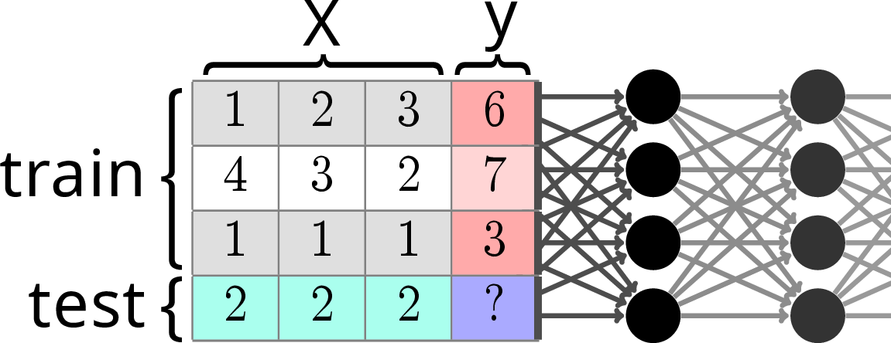
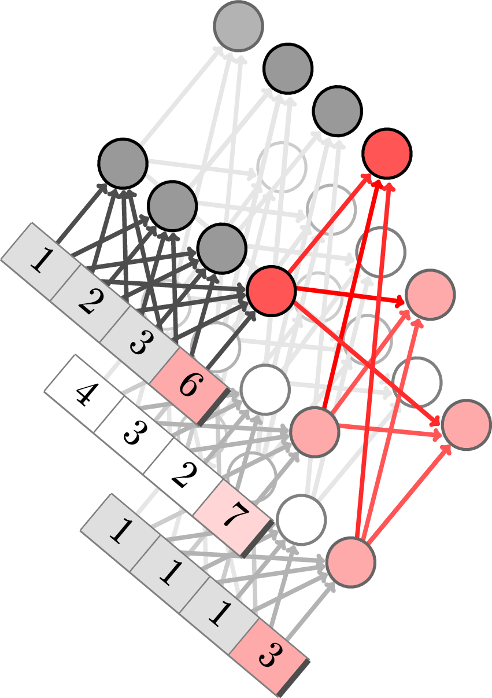
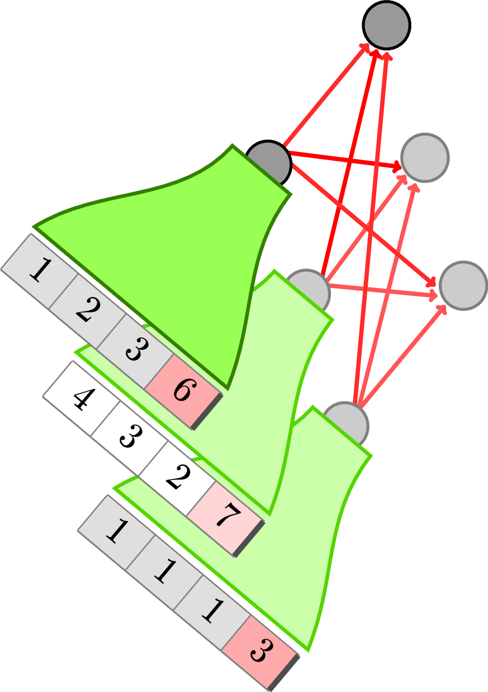
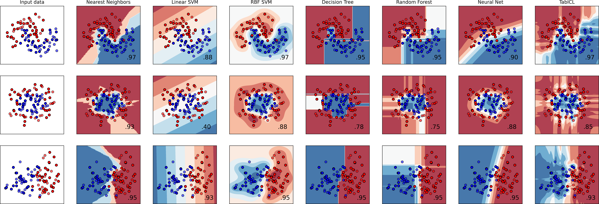

========================================================
TabICL: Pretraining to build the best tabular learning
========================================================

:date: 2025-07-07
:tags: machine learning, tabular learning, foundation models

.. note::

   TabICL is a state-of-the-art tabular learner. The key is it a very
   rich prior, that is baked in a pre-trained architecture -a table
   foundation model-, and leveraged by in-context-learning. Thanks to
   clever choices, it is fast and scalable, efficient even without a GPU.

.. contents::
   :depth: 2

Recent progress in tabular learning: In Context Learning
==========================================================

Describing the statistical structure of tables in general is very subtle.
They do have some unique statistical feature. For instance, each column
is typical meaningful by itself, and more than linear combinations of
columns (data *non rotationally invariant*, cf `[Grinsztajn et al, 2022]
<https://proceedings.neurips.cc/paper_files/paper/2022/hash/0378c7692da36807bdec87ab043cdadc-Abstract-Datasets_and_Benchmarks.html>`_).
For long, tree-based models, in particular gradient-boosted trees, were
the models that captured best this statistical structure.

The question is indeed: **how to build complex and rich inductive biases
into statistical models**?

The group of `F. Hutter
<https://ml.informatik.uni-freiburg.de/profile/hutter>`_ pionneered new
answers to this question with their TabPFN work `[Hollmann et al, 2025
<https://www.nature.com/articles/s41586-024-08328-6>`_.

Tabular learning as a completion problem
-----------------------------------------

   Prediction by table completion using across-row transformers

The key idea behind this line of work is that tabular learning can be
seen as completing a table where one column has a missing entry.
Transformer-based large-language models are very good at completing
sequences, in particular in the few-shot regime. Hence the idea to use a
transformer architecture for this table-completion task.

More specifically, this is a *meta-learning* setting (learning to learn),
using transformers.

Sophisticated prior via data generation
----------------------------------------

Teaching transformers to predict well requires showing them many many
prediction problems.

The benefit of this approach is that these prediction problems can be
chosen to reflect well the downstream task. In particular, in becomes now
easy to bake in any form of inductive bias by simulating data.

TabPFN simulates data by cascading a series of simple transformations
combining very few columns. The data-generative processes are actually
more subtle, but the idea being that they are plausible for data tables.

|

TabICL: improved architecture
================================

The challenge: accounting for the structure of tables
-----------------------------------------------------

   Tables are 2D objects, and the TabPFNv2 architecture alternates
   attentions across row and across columns

TabICL's solution
-------------------

   To break the quadratic cost, TabICL first encodes the rows to a
   smaller, fixed-sized, represention, before performing across-row
   in-context learning.

|

   A classic classification comparison plot that shows the decision
   boundaries on very simple toy data. It is useful to get a feeling of
   how classifiers behave.

.. note::

   TabICL is only one aspect of table foundation models. We are pursuing
   also another line of research that focuses on bringing knowledge about
   the real world in table foundation models, see `CARTE
   <carte-toward-table-foundation-models.html>`_ and more recently `[Kim
   et al, 2025] <https://arxiv.org/abs/2505.14415>`_.

