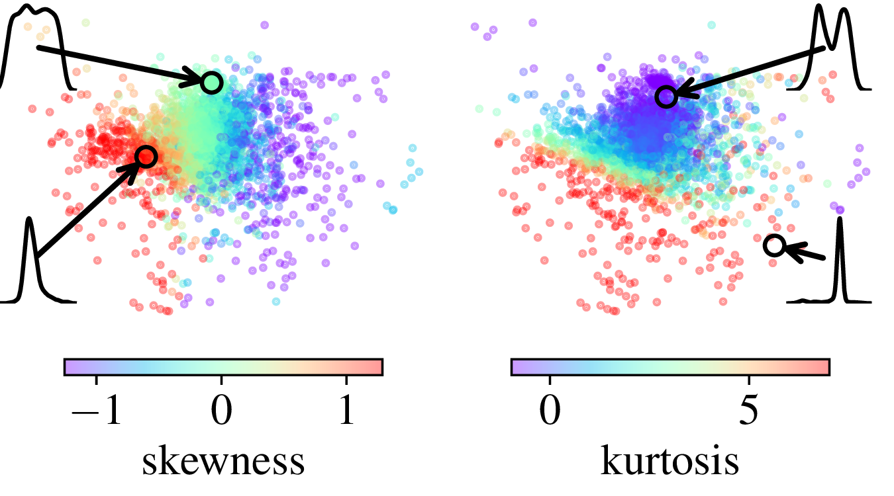
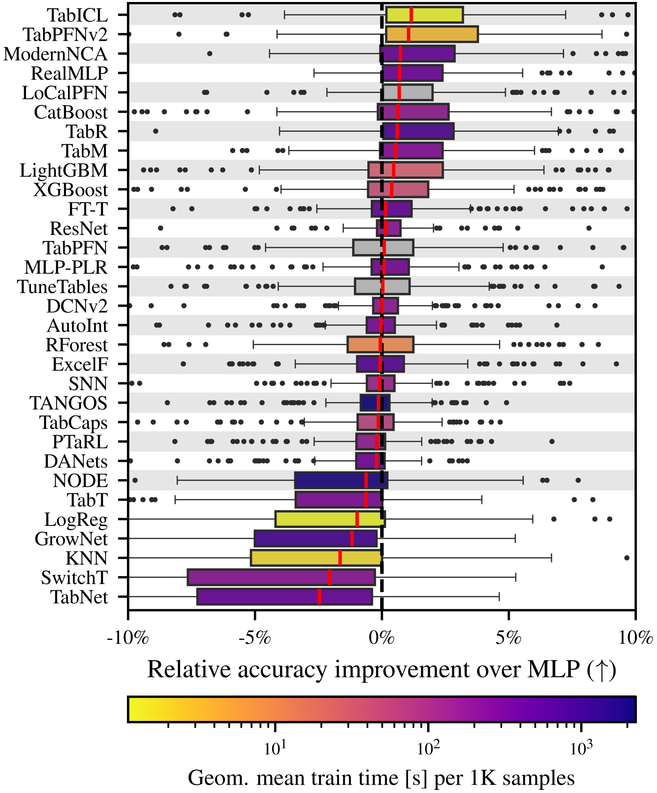
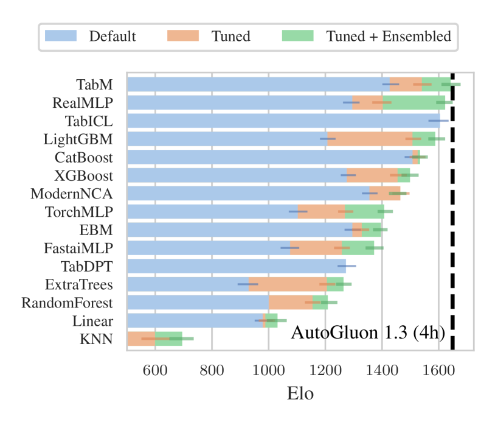
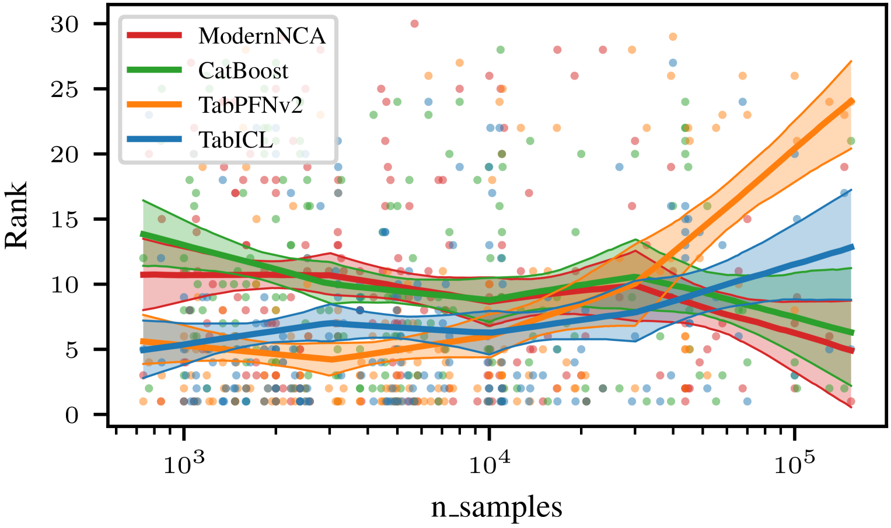

========================================================
TabICL: Pretraining the best tabular learner
========================================================

:date: 2025-07-09
:tags: machine learning, tabular learning, foundation models

.. note::

   TabICL is a state-of-the-art tabular learner `[Qu et al 2025]
   <https://arxiv.org/abs/2502.05564>`_. The key is its very rich
   prior, that is baked in a pre-trained architecture -a table foundation
   model-, and leveraged by in-context-learning. Thanks to clever
   choices, it is fast and scalable, efficient even without a GPU.

.. contents::
   :depth: 2

This note is about the research behind TabICL `[Qu et al 2025]
<https://arxiv.org/abs/2502.05564>`_, work by Jingang Qu, David
Holzmüller, myself, and Marine Le Morvan, published at ICML 2025.

|

Recent progress in tabular learning: In-Context Learning
==========================================================

Describing the statistical structure of tables in general is very subtle.
They do have some unique statistical features. For instance, each column
is typically meaningful by itself, more meaningful than linear
combinations of columns (data *non rotationally invariant*, cf
`[Grinsztajn et al, 2022]
<https://proceedings.neurips.cc/paper_files/paper/2022/hash/0378c7692da36807bdec87ab043cdadc-Abstract-Datasets_and_Benchmarks.html>`_).
For long, tree-based models, in particular gradient-boosted trees, were
the models that best captured this statistical structure.

The question is indeed: **how to build complex and rich inductive biases
into statistical models**?

A pioneering contribution to this question was made with the TabPFN
approach `[Hollmann et al, 2025]
<https://www.nature.com/articles/s41586-024-08328-6>`_.

Tabular learning as a completion problem
-----------------------------------------

.. figure:: ../science/attachments/tabicl/table_in_context_learning.png
   :width: 100%
   :align: right

   Prediction by table completion using across-row transformers

The key idea behind this line of work is that tabular learning can be
seen as completing a table where one column has a missing entry.
Transformer-based large-language models are very good at completing
sequences, in particular in the few-shot regime. Hence the idea to use a
transformer architecture for this table-completion task.

More specifically, this is a *meta-learning* setting (learning to learn),
using transformers.

Sophisticated prior via data generation
----------------------------------------

Teaching transformers to predict well requires showing them many many
prediction problems.

The benefit of this approach is that these prediction problems can be
chosen to reflect well the downstream task. In particular, it becomes now
easy to bake in any form of inductive bias by simulating data.

TabPFN simulates data by cascading a series of simple transformations
combining very few columns. The data-generative processes are actually
more subtle, but the idea being that they are plausible for data tables.

Experience (from us and others) shows that pretraining on a quality
data-generation process is crucial to produce a good tabular learner,
alike foundation models in other settings.

|

TabICL: improved architecture
================================

The challenge: accounting for the structure of tables
-----------------------------------------------------

.. figure:: ../science/attachments/tabicl/tabpfn_architecture.png
   :width: 60%
   :align: right

   Tables are 2D objects, and the TabPFNv2 architecture alternates
   attentions across row and across columns

In practice, a table is not a 1D structure, like sentences. It is closer
to a 2D structure, with rows and columns. A good architecture will
account for this structure, and the TabPFNv2 architecture uses
transformers with alternating across-row and across-column attention.

One problem is the computational complexity: attention is quadratic in
the number of entries, and the bi-directional transform of TabPFNv2 leads
to a cost in *O(n p² + p n²)* for a table with *n* rows and *p* columns.

TabICL's solution
-------------------

Row-wise encoding
..................

.. figure:: ../science/attachments/tabicl/tabicl_architecture.png
   :width: 60%
   :align: right

   To break the quadratic cost, TabICL first encodes the rows to a
   smaller, fixed-sized, represention, before performing across-row
   in-context learning.

For more scalability and better inductive bias, our model, TabICL, first
embeds the rows (using a first transformer) and then does in-context
learning across rows (with a second transformer). The resulting
computational complexity is *O(n p² + n²)*, which is more scalable,
though still quadratic in *n* and *p*.

Scalability is important because it enables us to pretrain TabICL on both
small *and* large datasets, and as a consquence TabICL is a good
predictor for large datasets.

|

Column-specific embeddings
...........................

   To apply different transformations on columns depending on their
   statistical properties, TabICL builds positional embeddings for
   columns that capture aspects of their distribution.

Another important innovation of TabICL is that it inputs the entries in
the transformer with column-specific embeddings. These column embeddings
are computed to be a function of the distribution of the column. For
this, we use a set transformer, which is a scalable transformer-like way
of building a function on sets (but without the quadratic complexity).

After pretraining, we find that the column embeddings have learned a
mapping that implicitly captures statistical aspects of the data
distribution in the column, as the kurtosis or the skewness.

The result: a powerful and easy to use tabular learner
=======================================================

After a lot of pretraining on synthetic data, TabICL is a
state-of-the-art tabular learner. Pretraining gave it the right inductive
bias, as visible from the classifier-comparison plot below:

.. figure:: ../science/attachments/tabicl/tabicl_comparison.png
   :width: 100%

   A classic classification comparison plot that shows the decision
   boundaries on very simple toy data. It is useful to get a feeling of
   how classifiers behave.

It is interesting to see that while TabICL forms very flexible decision
boundaries, they do extend along the horizontal and vertical axes, as the
decision tree and random forest. These axis-aligned features are a
very important aspect of the inductive bias.

At the end of the day, TabICL is an excellent tabular learner, as visible
on benchmarks:

   TabICL is a great predictor: Comparison of many predictors.

   Experimental results, from a benchmark paper independent of the TabICL
   paper: TabArena `[Erickson et al, 2025]
   <https://arxiv.org/abs/2506.16791>`_

|

The benefit of TabICL over TabPFNv2 becomes more marked for larger datasets:

   Rank (lower is best) as a function of dataset size.

However, one limitation to keep in mind is that with in-context learners,
as TabICL or TabPFN, inference (prediction on new datapoint) ican be
costly.

|

All in all, TabICL is an excellent tabular predictor, and a push forward
for tabular foundation models. From a fundamental standpoint, it shows
that in-context learning is not only for few-shot learning, but that it can be
very beneficial for sample sizes as large as *n=100 000*.

|

.. topic:: More about TabICL

   There is a lot more in TabICL: the details of pretraining are crucial,
   implementation uses memory offloading (which is facilitated by the
   architecture, which dissociates the train X from the test y for most
   of the operations). To learn more about TabICL:

   * The paper: https://arxiv.org/abs/2502.05564

   * The github code: **TabICL is 100% open source**
     https://github.com/soda-inria/tabicl

   * Install the Python package, TabICL is just one pip install away
     https://pypi.org/project/tabicl/

|

.. topic:: Other topics in table foundation models: leveraging strings

   TabICL is only one aspect of table foundation models. We are pursuing
   also another line of research that focuses on using strings (in
   entries and column names) to bring knowledge about the real world in
   table foundation models, see `CARTE
   <carte-toward-table-foundation-models.html>`_ and more recently `[Kim
   et al, 2025] <https://arxiv.org/abs/2505.14415>`_.

