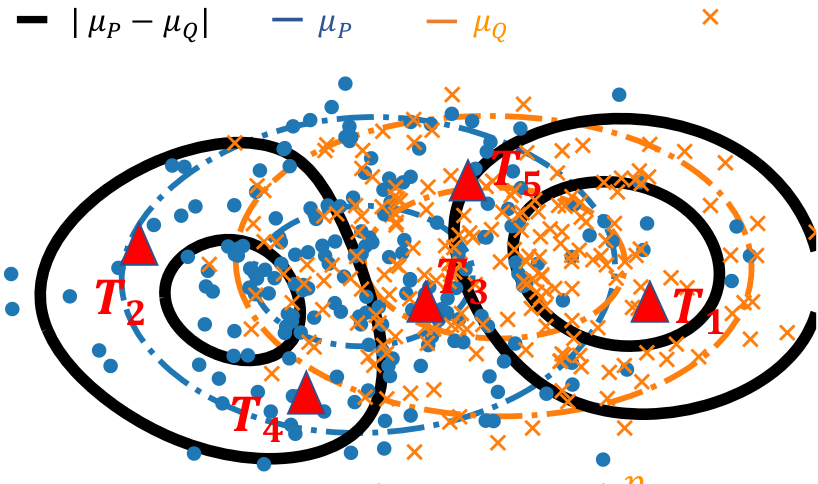

===============================================================================================================
Comparing distributions: Kernels estimate good representations, l1 distances give good tests
===============================================================================================================

:date: 2019-12-8
:authors: Meyer Scetbon & Gaël Varoquaux
:tags: science, research, machine learning, two-sample testing, conferences, statistics

.. note::

    Given two set of observations, are they drawn from the same
    distribution? Our paper `Comparing distributions: l1 geometry
    improves kernel two-sample testing
    <https://papers.nips.cc/paper/9398-comparing-distributions-ell_1-geometry-improves-kernel-two-sample-testing.html>`_
    at the **NeurIPS 2019 conference** revisits this classic statistical
    problem known as "two-sample testing".

    This post explains the context and the paper with a bit of hand
    waiving.

|

.. contents:: Contents
   :depth: 1

The context: two-sample testing
================================

Given two samples from two unknown populations, the goal of two-sample tests is
to determine whether the underlying populations differ with a statistical
significance. For instance, we may care to know whether the
McDonald's and KFC use different logic to chose locations of restaurants
across the US. This is a difficult question: we have access to data points,
but not the underlying generative mechanism, that is probably governed by
marketing strategies.

.. image:: attachments/comparing_distributions_l1/map_KFC_McDo_simple.png
   :width: 70%
   :align: center

From kernel mean embeddings to distances on distributions
==========================================================

In the example of spatial distributions restaurants,
there is **a lot of information in how close observed data
points lie in the original measurement space (here geographic coordinates)**.
Kernel methods arise naturally to capture this information. They can be
applied to distributions, building representatives of distributions:
`Kernel embeddings of distributions
<https://en.wikipedia.org/wiki/Kernel_embedding_of_distributions>`_. The
mean embedding of a distribution P with a kernel k is written:

.. math::
   \mu_P(t):= ∫_{\mathbb{R}^d}k(x,t)dP(x)

Intuitively, it is related to `Kernel Density Estimates (KDEs)
<https://en.wikipedia.org/wiki/Kernel_density_estimation>`_ which
estimate a density in continuous space by smoothing the observed data
points with a kernel.

   Kernel mean embeddings for two distributions of points

For two-sample testing, kernel embeddings can be used to compute distances
between distributions, building metrics over the space of probability
measures. Metrics between probability measures can be defined via the
notion of Integral Probability Metric (IPM): as a difference of
expectations:

.. math::
   \text{IPM}[F,P,Q]:=\sup_{f\in F}(\mathbb{E}_{x\sim
   P}\left[f(x)\right]-\mathbb{E}_{y\sim Q}\left[f(y)\right])

where F is a class of functions. This definition is appealing because it
**characterizes the difference between P and Q by the function for which
the expectancy differs most**. The specific choice of class of function
defines the metric. If we now consider a kernel, it implicitly defines a
space of functions (intuitively related to all the possible KDEs
generated by varying data points): a Reproducible Kernel Hilbert Space
(RKHS). Defining a metric (an IPM) with a function class F as the unit
ball in such an RKHS, is known as the Maximum Mean Discrepancy (MMD). It
can be shown that, rather than computing the maximum, the MMD has a more
convenient expression, the RKHS distance between the mean embeddings:

.. math::
   \text{MMD}[P,Q]=\Vert \mu_P-\mu_Q\Vert_{H_k}

For good choices of kernels, the MMD has appealing mathematical
properties to compare distributions. With kernels said to be
characteristic, eg Gaussian kernels, the MMD is a metric: MMD[P, Q] = 0
if and only if P = Q. Using the MMD for two-sample testing –given only
observations from the distributions, and not P and Q–  requires using an
empirical estimation of the MMD. This can be done by computing the RKHS
norm in the expression above, which leads to summing kernel evaluations
on all data points in P and Q.

Our work builds upon this framework, but deviates a bit from the
classical definition of MMD as it addresses the question of which norm is
best to use on the difference of mean embeddings, µQ - µP (as well as
other representatives, namely the smooth characteristic function, SCF).
We consider a wider family of metrics based on the Lp distances between
mean emdeddings (p=2 recovers the classic framework):

.. math::
   d_{L^p,\mu}(P,Q):=\left(\int_{t\in\mathbb{R}^d }|\mu_P(t)-\mu_Q(t)|^p d\Gamma(t)\right)^{1/p}

where Γ is a Borel probability measure absolutely continuous.

Controlling the weak convergence of probability measures
==========================================================

We show that these metrics have good properties. Specifically, for p ≥ 1,
as soon as the kernel is bounded continuous and characteristic, these
metrics metrize the weak convergence. What this means is that these
metrics tend to zero if and only if P and Q weakly converge.

The `weak convergence of probability measures
<https://en.wikipedia.org/wiki/Convergence_of_measures#Weak_convergence_of_measures>`_
is a notion of convergence that is based **not just on having events with
probabilities that are the same for the two distributions, but also that some events are
“close”**. Indeed, classic convergence in probability just tells us that
the same observation should have the same probability in the two distributions. Weak convergence takes in account the topology of the
observations. For instance, to go back to the problem of spatial
distributions of restaurants, it does not only look at whether the
probabilities of having a Mc Donald’s or a KFC restaurant converge on
11th Wall Street, but also at restaurants are likely on 9th Wall Street.

A simple example to see why these matters is to consider two Dirac
distributions: spikes in a single point. If we bring these spikes closer
and closer, merely looking at the probability of events in the same exact
position will not detect any convergence until the spikes exactly
overlap.

Using kernel embeddings of distributions enables to capture the aspects
of convergence in the spatial domain because the kernels used give a
spatial smoothness to the representatives:

Having a metric on probability distributions that captures the topology
of the observations is important for many applications, for instance when
fitting GANs to generate images: the goal is not to only capture that
images are exactly the same, but also that they maybe be "close".

Two-sample testing procedures
==============================

Now that we have built metrics, we can derive two-sample test statistics.
A straightforward way of doing it would involve large sums on all the
observations, which would be costly. Hence, we resort to a good
approximation by sampling a set of {Tj} locations from the distribution
Γ:

.. math::

   \hat{d}^p_{\ell_p,\mu,J}[X,Y]:=n^{p/2}\sum_{j=1..J}|\mu_X(T_j)-\mu_Y(T_j)|^p

We show that this approximation maintains (almost surely) the appealing
metric properties, generalizing the results that were established by
`Chwialkowski et al 2015
<http://papers.nips.cc/paper/5685-fast-two-sample-testing-with-analytic-representations-of-probability-measures>`_
for the special case of the L2 metric.

   Sampling at different positions

We further develop the testing procedures by showing that other tricks
known to improve testing with the L2 metric can be adapted to other
metrics, such as the L1 metric. Fast and performant tests can be obtained
by optimizing the test locations –using an upper-bound on the test power–
or by testing in the Fourrier domain, using the Smooth Characteristic
Function of the kernel. Even in the case of the L1 metric, the null
distribution of the test statistic can be derived, leading to tests that
can control errors without permutations.

The L1 metric provides best testing power
==========================================

Going back to our question of which norm on the difference of
distribution representative is best suited to detect, we show that when
using analytics kernels, such as the Gaussian kernel, the L1 metric
improves upon the L2 metric, which corresponds to the classic definition
of the MMD.

Indeed, analytic kernels are non-zero almost everywhere. As a result,
when P is different from Q, the difference between their mean embeddings
will be dense, as well as the differences between the representatives
that we use to build our tests (for instance the values at the locations
that we use to build the tests above). l1 norms capture better dense
differences than l2 norms –this is the reason why, used as penalties,
they induce sparsity.

.. image:: attachments/comparing_distributions_l1/l1_vs_l2.png
   :align: right
   :width: 150px

A simple intuition is that dense vectors tend to lie in the diagonals of
the measurement basis, as none of their coordinates are zero. On these
diagonals, the l1 norm is much larger than the l1 norm of vectors with
some zero, or nearly-zero coordinates.

.. topic:: **Summary**

   For a very simple summary, the story is that: to perform tests of
   whether two distributions differs, it is useful to compute a "mean
   Kernel embedding" –similar to a Kernel density estimate, but without
   normalization– of each distribution, and consider the l1 norm of the
   difference of these embeddings. They can be computed on a small number
   of locations, either drawn at random or optimized. This approach is
   reminiscent of looking at the total variation between the measures,
   however the fact that it uses Kernels makes it robust to small spatial
   noise in the observations, unlike the total variation for which events
   must perfectly coincide in both set of observations (the total
   variation does not metrize the weak convergence).

.. topic:: **References**

   The framework exposed here is one that was developed over a long line
   of research, which our work builds upon. `Our paper
   <https://papers.nips.cc/paper/9398-comparing-distributions-ell_1-geometry-improves-kernel-two-sample-testing.html>`_
   gives a complete list of references, however, some useful review
   papers are
   
   * C.-J. Simon-Gabriel and B. Schölkopf. Kernel distribution
     embeddings: Universal kernels, *characteristic kernels and kernel
     metrics on distributions*, `arXiv:1604.05251
     <https://arxiv.org/abs/1604.0525>`_, 2016.

   * A. Gretton, K.M. Borgwardt, M.J. Rasch, B. Schölkopf, A. Smola; *A
     Kernel Two-Sample Test*, `JMLR, 2012
     <http://www.jmlr.org/papers/v13/gretton12a.html>`_.

   * `The NeurIPS 2019 tutorial
     <https://slideslive.com/38921490/interpretable-comparison-of-distributions-and-models>`_,
     by Gretton, Sutherland, and Jitkrittum, is extremely didactic and gives
     a lot of big picture

· 
